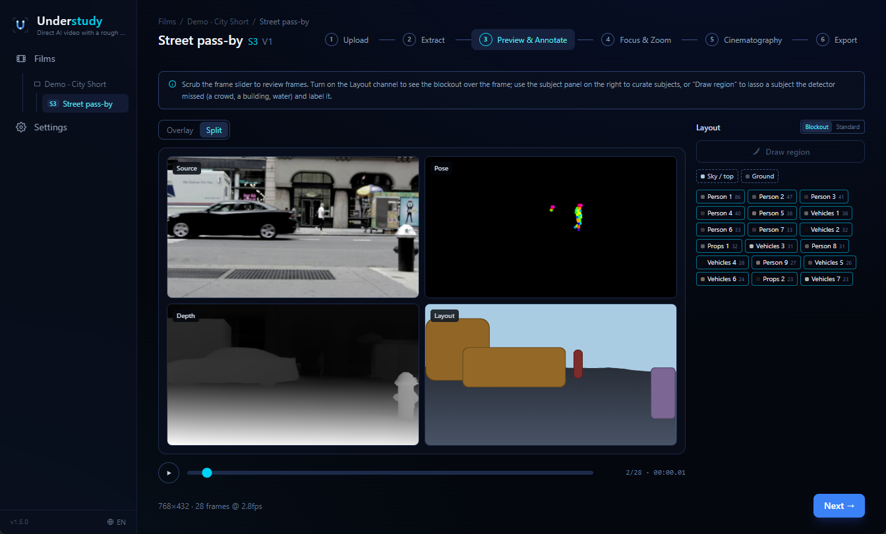
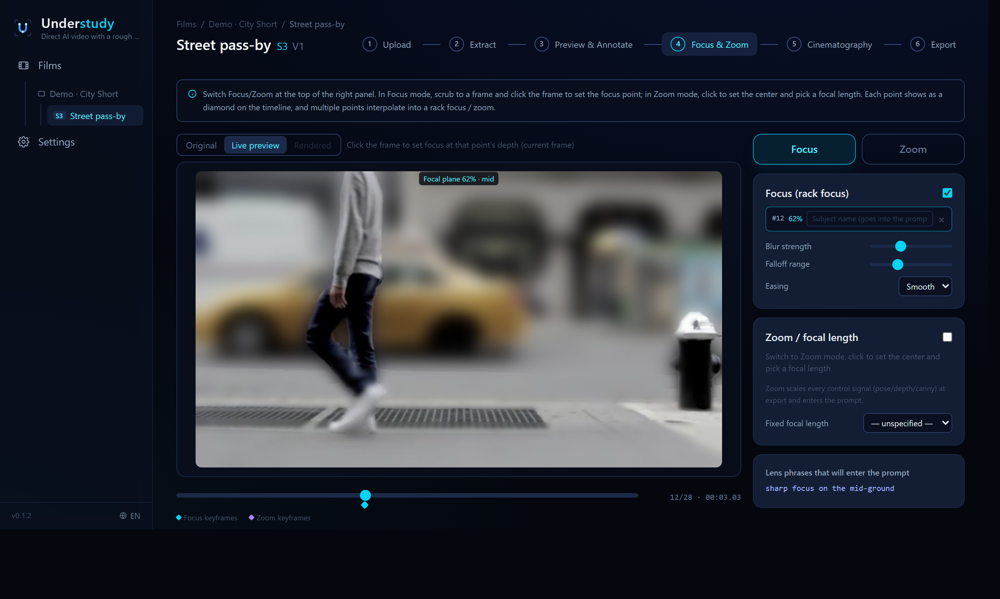
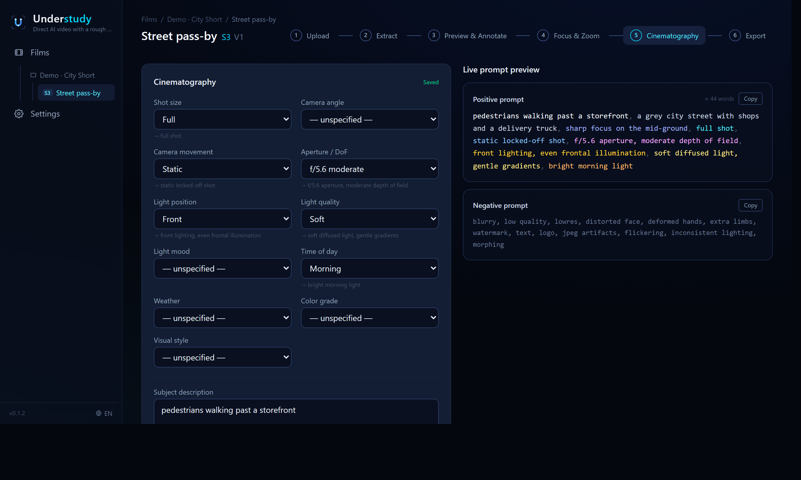

<p align="center">
  
</p>

<p align="center">
  <b>Stop describing your shot. Perform it.</b><br>
  <sub>Understudy turns a rough reference take into precise control signals for AI video — you keep the look, the footage carries the blocking.</sub>
</p>

<p align="center">
  
  
  
  
</p>

---

## The problem

Text-to-video is a slot machine. You type *"she walks in from the left, the camera pushes in, focus stays on her face"* — and hope. The model rarely does the same thing twice, and words simply can't pin down **where** someone stands, **how** they move, or **where** the lens is focused. So you re-roll prompts for hours, fighting the model for control it was never going to give you.

Meanwhile the things you *can* control precisely — blocking, motion, timing, framing, focus — are the exact things a text box throws away.

## The idea

**Perform the shot instead of describing it.** Grab a rough reference take on your phone, and Understudy extracts the parts a prompt can't carry — **pose, depth, and a rough scene layout, frame by frame** — pairs them with a director-set focus plan and cinematography, and exports a clean package a controllable video model *follows*.

> **Your footage carries the blocking and motion. You keep full control of the look.**

The background you filmed is just a placeholder: Understudy keeps the blocking and a coarse spatial layout, and the AI regenerates the whole look from your prompt.

Drop the package into a ControlNet-style pipeline (ComfyUI **Wan Fun-Control** / **VACE** / **LTX-2**) or a commercial platform, and the generation obeys your take.

## Features

### 🎯 Extract the signals a prompt throws away — then block out the scene
A text box can't hold where people stand, how they move, or what's in frame. Understudy decodes your take once and pulls three control channels per frame — OpenPose-style **pose**, relative **depth**, and a selective **layout** blockout — in a synced side-by-side preview. The detector blocks out the cinematic subjects (people, vehicles, animals, props) on a minimal ground/sky backdrop; keep the ones that matter, drop the rest, and **lasso in** anything it missed — a crowd, a building, water — with a label. The blockout says *where* things sit; the prompt says *what* they are.

<p align="center"></p>

### 🔎 Direct the focus and zoom
Text can't say *where* the lens is focused, or when it racks. Click a point to lock the focal plane onto that depth, keyframe a **rack focus** across the shot, or flip on **follow-subject** so focus tracks the performer automatically as they move. Lay down **zoom / focal-length** segments too — they scale every control signal on export. Understudy renders the depth-of-field straight from the depth map, so the intent is baked into the signals, not just described.

<p align="center"></p>

### 📝 Compose a prompt that matches the signals
Perfect signals still need words that agree with them — and hand-writing a cinematographer's prompt is fiddly. Pick shot size, angle, movement, aperture, **shutter**, lighting, time of day and color grade from a curated vocabulary; Understudy assembles a clean positive/negative prompt in real time — folding in your lens phrasing and the subjects you drew — so the text never drifts from what you're exporting.

<p align="center"></p>

## How it works

A film holds many shots; each shot runs a six-step wizard:

**Upload** → **Extract** (pose / depth / layout) → **Preview & Annotate** → **Focus & Zoom** → **Cinematography** → **Export**

Organize a whole short by scene and version, duplicate a shot as a new take (reusing its extraction), and lay the sequence out on a spatial whiteboard.

## Install & run

Everything lives inside the project folder; the launcher sits next to it. Requires **Python 3.11** (ML wheels don't support 3.13/3.14 yet) and **Node.js**.

### Windows

```powershell
scripts\setup.ps1          # create the venv, install deps, build the UI, fetch models
```

Then **double-click `Understudy.exe`** — the app opens in a native WebView2 window (no Chrome needed). Server and window share one process, so closing the window shuts everything down.

### macOS (Apple Silicon / Intel)

```bash
bash scripts/mac/setup.sh      # create the venv, install deps, build the UI, fetch models
bash scripts/mac/build_app.sh  # assemble Understudy.app (with icon) at the repo root
```

Then **double-click `Understudy.app`** — it opens in a native WKWebView window. Apple Silicon uses **CoreML** for depth by default; switch backends anytime in Settings (takes effect immediately, no restart). Locally built `.app` bundles aren't quarantined, so no signing needed.

Browser / console fallbacks: `scripts\run.ps1` · `scripts\dev.ps1` (Windows) and `scripts/mac/run.sh` · `scripts/mac/dev.sh` (macOS).

## The export package

`<Film>_S<scene>_<shot>_V<version>_<timestamp>.zip`:

- `prompt.txt` / `prompt_negative.txt` — the composed prompts, ready to paste
- `pose/ depth/` — control-signal PNG sequences + `pose/keypoints.json` skeleton coordinates
- `focus/` + `video/focus_preview.mp4` — the rendered depth-of-field / rack focus (when set)
- `video/` — the same channels as H.264 mp4 (for web upload)
- `frames/` — downsampled source frames (VACE reference / first-frame)
- `layout/ blockout/` — scene-layout blocks (ADE20K palette for ControlNet-Seg, plus a grouped-color depth-shaded blockout), including director-drawn lasso subjects — their labels also join the prompt
- `metadata.json` + a bilingual `README.txt` usage guide

## Tech stack

| Layer | Tech |
|---|---|
| Frontend | React + Vite + TypeScript + Tailwind CSS v4 (dark theme, English / Chinese) |
| Backend | FastAPI (Python 3.11) + SQLite + filesystem assets |
| Desktop | pywebview → WebView2 (Windows) / WKWebView (macOS), single process |
| Pose | rtmlib (RTMPose ONNX, OpenPose-style skeletons) |
| Depth | Depth Anything V2 Small (ONNX) |
| Layout | TopFormer sky/ground segmentation + YOLOX subject detector (ONNX) |
| Inference | ONNX Runtime — CPU everywhere; DirectML (Windows) / CoreML (macOS) optional |

## Project layout

```
backend/    FastAPI app (api / services / extractors) + desktop.py entry point
frontend/   React SPA
scripts/    setup & launch scripts (Windows *.ps1, macOS scripts/mac/*.sh)
docs/       README assets
data/       runtime data — SQLite + per-shot assets (git-ignored)
models/     model cache (git-ignored)
```

## Development

```powershell
.venv\Scripts\python.exe -m pytest backend\tests -q
```

The prompt builder is mirrored between backend and frontend so the live preview matches the exported prompt exactly; unit tests guard that parity, the lens/focus math, the layout blockout rendering, and the cross-platform inference-backend selection.

## License & credits

Licensed under the **Apache License 2.0** — see [LICENSE](LICENSE). © 2026 Ryan Yan.

Built on the work of others; see [NOTICE](NOTICE) for third-party models, libraries, and demo footage attribution. In short: pose from **RTMPose / rtmlib**, depth from **Depth Anything V2**, scene layout from **TopFormer** + **YOLOX**, inference via **ONNX Runtime**, and demo control signals derived from short public sample clips (Pexels · OpenCV) — original videos are not redistributed.
